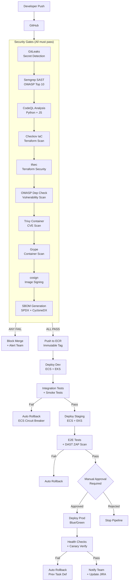
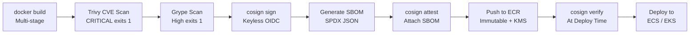

# CI/CD Pipeline Architecture

## Full Pipeline Flow

```mermaid
flowchart TD
    DEV[Developer Push] --> GH[GitHub]

    subgraph GATES["Security Gates (All must pass)"]
        direction TB
        G1[GitLeaks\nSecret Detection] --> G2[Semgrep SAST\nOWASP Top 10]
        G2 --> G3[CodeQL Analysis\nPython + JS]
        G3 --> G4[Checkov IaC\nTerraform Scan]
        G4 --> G5[tfsec\nTerraform Security]
        G5 --> G6[OWASP Dep Check\nVulnerability Scan]
        G6 --> G7[Trivy Container\nCVE Scan]
        G7 --> G8[Grype\nContainer Scan]
        G8 --> G9[cosign\nImage Signing]
        G9 --> G10[SBOM Generation\nSPDX + CycloneDX]
    end

    GH --> GATES
    GATES -- "ANY FAIL" --> BLOCK[Block Merge\n+ Alert Team]
    GATES -- "ALL PASS" --> ECR[Push to ECR\nImmutable Tag]

    ECR --> DEV_DEPLOY[Deploy Dev\nECS + EKS]
    DEV_DEPLOY --> DEV_TEST[Integration Tests\n+ Smoke Tests]
    DEV_TEST -- Fail --> ROLLBACK_D[Auto Rollback\nECS Circuit Breaker]
    DEV_TEST -- Pass --> STG_DEPLOY[Deploy Staging\nECS + EKS]

    STG_DEPLOY --> STG_TEST[E2E Tests\n+ DAST ZAP Scan]
    STG_TEST -- Fail --> ROLLBACK_S[Auto Rollback]
    STG_TEST -- Pass --> APPROVAL{Manual Approval\nRequired}

    APPROVAL -- Approved --> PROD_DEPLOY[Deploy Prod\nBlue/Green]
    APPROVAL -- Rejected --> STOP[Stop Pipeline]
    PROD_DEPLOY --> PROD_VERIFY[Health Checks\n+ Canary Verify]
    PROD_VERIFY -- Fail --> ROLLBACK_P[Auto Rollback\nPrev Task Def]
    PROD_VERIFY -- Pass --> NOTIFY[Notify Team\n+ Update JIRA]
```

## Terraform Workflow

```mermaid
flowchart LR
    PR[PR Opened] --> FMT[terraform fmt -check]
    FMT --> VALIDATE[terraform validate\nAll Modules]
    VALIDATE --> CHECKOV[Checkov Scan]
    CHECKOV --> TFSEC[tfsec Scan]
    TFSEC --> PLAN[terraform plan\nComment on PR]
    PLAN --> REVIEW[Team Review]
    REVIEW -- Approved --> MERGE[Merge to Main]
    MERGE --> APPLY_DEV[terraform apply\nDev Auto]
    APPLY_DEV --> APPLY_STG[terraform apply\nStaging Auto]
    APPLY_STG --> APPROVAL2{Approval}
    APPROVAL2 -- Yes --> APPLY_PROD[terraform apply\nProd]
```

## Container Supply Chain Security

```mermaid
flowchart LR
    BUILD[docker build\nMulti-stage] --> TRIVY[Trivy CVE Scan\nCRITICAL exits 1]
    TRIVY --> GRYPE[Grype Scan\nHigh exits 1]
    GRYPE --> SIGN[cosign sign\nKeyless OIDC]
    SIGN --> SBOM[Generate SBOM\nSPDX JSON]
    SBOM --> ATTEST[cosign attest\nAttach SBOM]
    ATTEST --> ECR[Push to ECR\nImmutable + KMS]
    ECR --> VERIFY[cosign verify\nAt Deploy Time]
    VERIFY --> DEPLOY[Deploy to\nECS / EKS]
```
