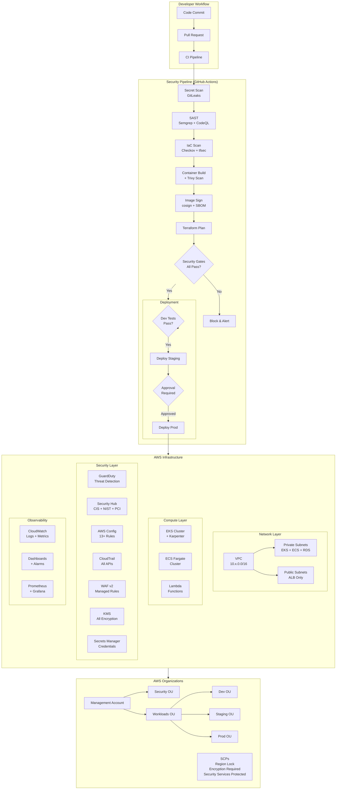
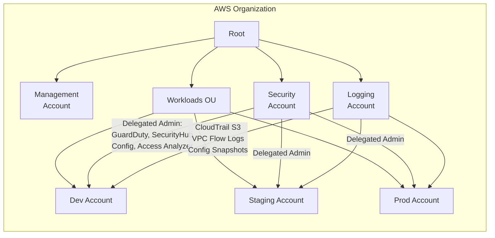
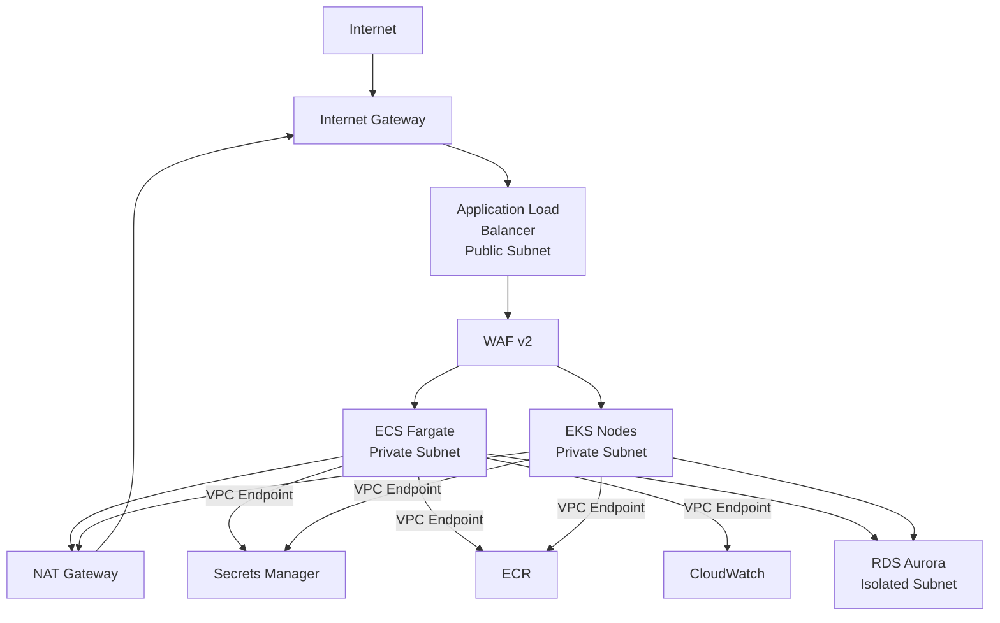

# Architecture Overview

## End-to-End DevSecOps on AWS

```mermaid
graph TB
    subgraph DEV["Developer Workflow"]
        direction LR
        CODE[Code Commit] --> PR[Pull Request]
        PR --> CI[CI Pipeline]
    end

    subgraph PIPELINE["Security Pipeline (GitHub Actions)"]
        direction TB
        CI --> SS[Secret Scan\nGitLeaks]
        SS --> SAST[SAST\nSemgrep + CodeQL]
        SAST --> IAC[IaC Scan\nCheckov + tfsec]
        IAC --> CONT[Container Build\n+ Trivy Scan]
        CONT --> SIGN[Image Sign\ncosign + SBOM]
        SIGN --> PLAN[Terraform Plan]
        PLAN --> GATE{Security Gates\nAll Pass?}
        GATE -- No --> BLOCK[Block & Alert]
        GATE -- Yes --> DEPLOY
    end

    subgraph DEPLOY["Deployment"]
        direction TB
        DEPLOY[Deploy Dev] --> DGATE{Dev Tests\nPass?}
        DGATE -- Yes --> STAGING[Deploy Staging]
        STAGING --> SGATE{Approval\nRequired}
        SGATE -- Approved --> PROD[Deploy Prod]
    end

    subgraph AWS_INFRA["AWS Infrastructure"]
        direction TB
        subgraph NETWORK["Network Layer"]
            VPC[VPC\n10.x.0.0/16]
            VPC --> PRIV[Private Subnets\nEKS + ECS + RDS]
            VPC --> PUB[Public Subnets\nALB Only]
        end

        subgraph COMPUTE["Compute Layer"]
            EKS[EKS Cluster\n+ Karpenter]
            ECS[ECS Fargate\nCluster]
            LAMBDA[Lambda\nFunctions]
        end

        subgraph SECURITY["Security Layer"]
            GD[GuardDuty\nThreat Detection]
            SH[Security Hub\nCIS + NIST + PCI]
            CONFIG[AWS Config\n13+ Rules]
            CT[CloudTrail\nAll APIs]
            WAF[WAF v2\nManaged Rules]
            KMS[KMS\nAll Encryption]
            SM[Secrets Manager\nCredentials]
        end

        subgraph OBSERVE["Observability"]
            CW[CloudWatch\nLogs + Metrics]
            DASH[Dashboards\n+ Alarms]
            PROM[Prometheus\n+ Grafana]
        end
    end

    subgraph ORG["AWS Organizations"]
        MGMT[Management Account]
        MGMT --> SEC_OU[Security OU]
        MGMT --> WORK_OU[Workloads OU]
        WORK_OU --> DEV_OU[Dev OU]
        WORK_OU --> STG_OU[Staging OU]
        WORK_OU --> PRD_OU[Prod OU]
        SCP[SCPs\nRegion Lock\nEncryption Required\nSecurity Services Protected]
    end

    PROD --> AWS_INFRA
    AWS_INFRA --> ORG
```

## Multi-Account Strategy

```mermaid
graph LR
    subgraph ORG["AWS Organization"]
        ROOT[Root]
        ROOT --> MGMT[Management\nAccount]
        ROOT --> SEC[Security\nAccount]
        ROOT --> LOG[Logging\nAccount]
        ROOT --> WORK[Workloads OU]
        WORK --> DEV[Dev Account]
        WORK --> STG[Staging Account]
        WORK --> PRD[Prod Account]
    end

    SEC -- "Delegated Admin:\nGuardDuty, SecurityHub\nConfig, Access Analyzer" --> DEV
    SEC -- "Delegated Admin" --> STG
    SEC -- "Delegated Admin" --> PRD
    LOG -- "CloudTrail S3\nVPC Flow Logs\nConfig Snapshots" --> DEV
    LOG --> STG
    LOG --> PRD
```

## Network Architecture

```mermaid
graph TB
    INTERNET[Internet] --> IGW[Internet Gateway]
    IGW --> ALB[Application Load\nBalancer\nPublic Subnet]
    ALB --> WAF_ATTACH[WAF v2]
    WAF_ATTACH --> ECS_TASK[ECS Fargate\nPrivate Subnet]
    WAF_ATTACH --> EKS_NODE[EKS Nodes\nPrivate Subnet]

    ECS_TASK --> NAT[NAT Gateway]
    EKS_NODE --> NAT
    NAT --> IGW

    ECS_TASK -- "VPC Endpoint" --> SM[Secrets Manager]
    ECS_TASK -- "VPC Endpoint" --> ECR[ECR]
    ECS_TASK -- "VPC Endpoint" --> CW2[CloudWatch]
    EKS_NODE -- "VPC Endpoint" --> SM
    EKS_NODE -- "VPC Endpoint" --> ECR

    ECS_TASK --> RDS[RDS Aurora\nIsolated Subnet]
    EKS_NODE --> RDS
```
