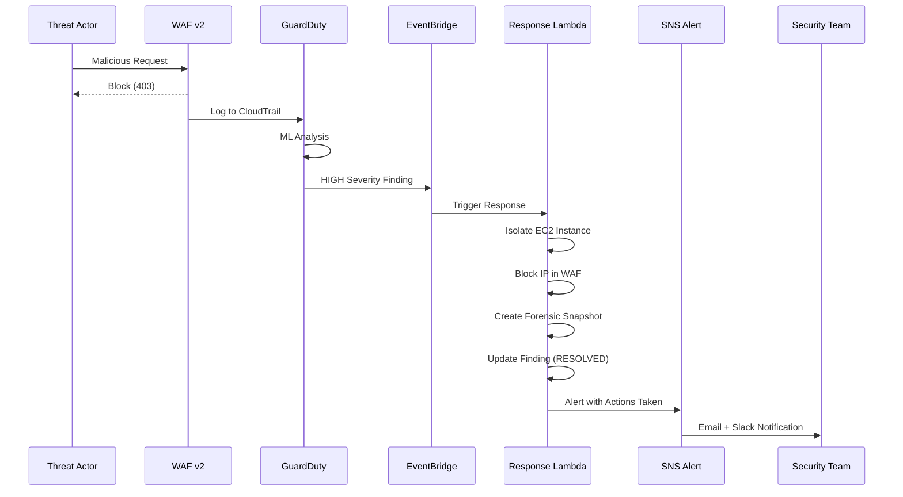
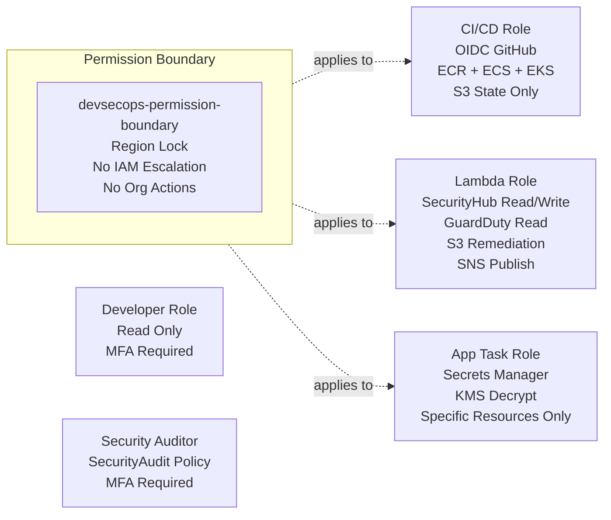

# Security Architecture

## Defense in Depth

```mermaid
graph TB
    subgraph LAYER1["Layer 1 — Perimeter"]
        WAF[AWS WAF v2\nManaged Rules\nRate Limiting\nGeo Blocking]
        SHIELD[AWS Shield\nStandard]
        CF[CloudFront\nDDoS Protection]
    end

    subgraph LAYER2["Layer 2 — Network"]
        SG[Security Groups\nLeast Privilege\nNo 0.0.0.0/0]
        NACL[NACLs\nStateless Filtering]
        FL[VPC Flow Logs\n→ CloudWatch]
        PRIV[Private Subnets\nNo Public IPs]
    end

    subgraph LAYER3["Layer 3 — Identity"]
        IAM[IAM Least Privilege\nPermission Boundaries]
        IRSA[IRSA for EKS Pods\nNo Long-Lived Keys]
        MFA[MFA Required\nAll Human Access]
        SCP[SCPs\nOrg-Level Guard Rails]
    end

    subgraph LAYER4["Layer 4 — Data"]
        KMS[KMS CMKs\nAll Data Encrypted]
        SM[Secrets Manager\nAuto Rotation]
        S3E[S3 Encryption\nBucket Policies\nNo Public Access]
    end

    subgraph LAYER5["Layer 5 — Application"]
        RBAC[K8s RBAC\nNamespace Isolation]
        PSS[Pod Security\nStandards Restricted]
        NP[Network Policies\nDefault Deny]
        RO[Read-Only\nRoot Filesystem]
    end

    subgraph DETECT["Detection & Response"]
        GD[GuardDuty\nML Threat Detection]
        SH[Security Hub\nCentralized Findings]
        CONFIG[AWS Config\n13+ Rules\nAuto-Remediation]
        CT[CloudTrail\nAll API Calls\nInsights]
        CW[CloudWatch Alarms\nRoot Login, IAM Changes\nSG Changes, No MFA]
        LAMBDA[Auto-Remediation\nLambda Functions]
    end

    LAYER1 --> LAYER2 --> LAYER3 --> LAYER4 --> LAYER5
    DETECT -- "monitors all layers" --> LAYER1
```

## Threat Detection & Response Flow

```mermaid
sequenceDiagram
    participant Threat as Threat Actor
    participant WAF as WAF v2
    participant GD as GuardDuty
    participant EB as EventBridge
    participant Lambda as Response Lambda
    participant SNS as SNS Alert
    participant Team as Security Team

    Threat->>WAF: Malicious Request
    WAF-->>Threat: Block (403)
    WAF->>GD: Log to CloudTrail
    GD->>GD: ML Analysis
    GD->>EB: HIGH Severity Finding
    EB->>Lambda: Trigger Response
    Lambda->>Lambda: Isolate EC2 Instance
    Lambda->>Lambda: Block IP in WAF
    Lambda->>Lambda: Create Forensic Snapshot
    Lambda->>Lambda: Update Finding (RESOLVED)
    Lambda->>SNS: Alert with Actions Taken
    SNS->>Team: Email + Slack Notification
```

## IAM Permission Model

```mermaid
graph LR
    subgraph BOUNDARY["Permission Boundary"]
        PB[devsecops-permission-boundary\nRegion Lock\nNo IAM Escalation\nNo Org Actions]
    end

    CICD[CI/CD Role\nOIDC GitHub\nECR + ECS + EKS\nS3 State Only]
    DEV[Developer Role\nRead Only\nMFA Required]
    SEC[Security Auditor\nSecurityAudit Policy\nMFA Required]
    LAMBDA_R[Lambda Role\nSecurityHub Read/Write\nGuardDuty Read\nS3 Remediation\nSNS Publish]
    APP[App Task Role\nSecrets Manager\nKMS Decrypt\nSpecific Resources Only]

    BOUNDARY -. "applies to" .-> CICD
    BOUNDARY -. "applies to" .-> LAMBDA_R
    BOUNDARY -. "applies to" .-> APP
```
