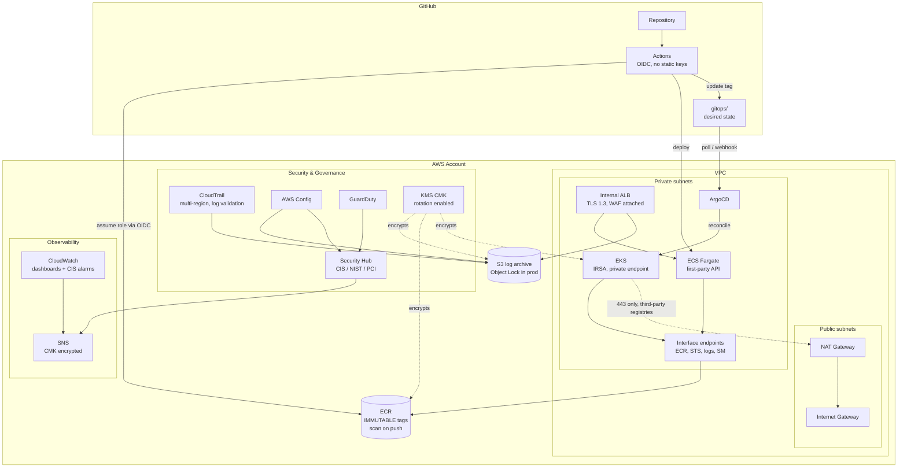
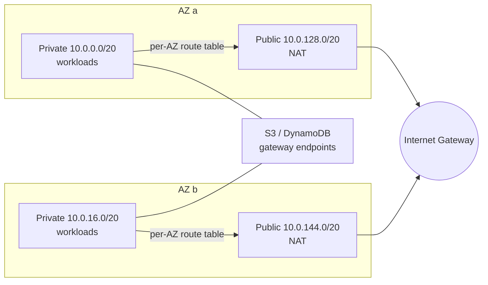
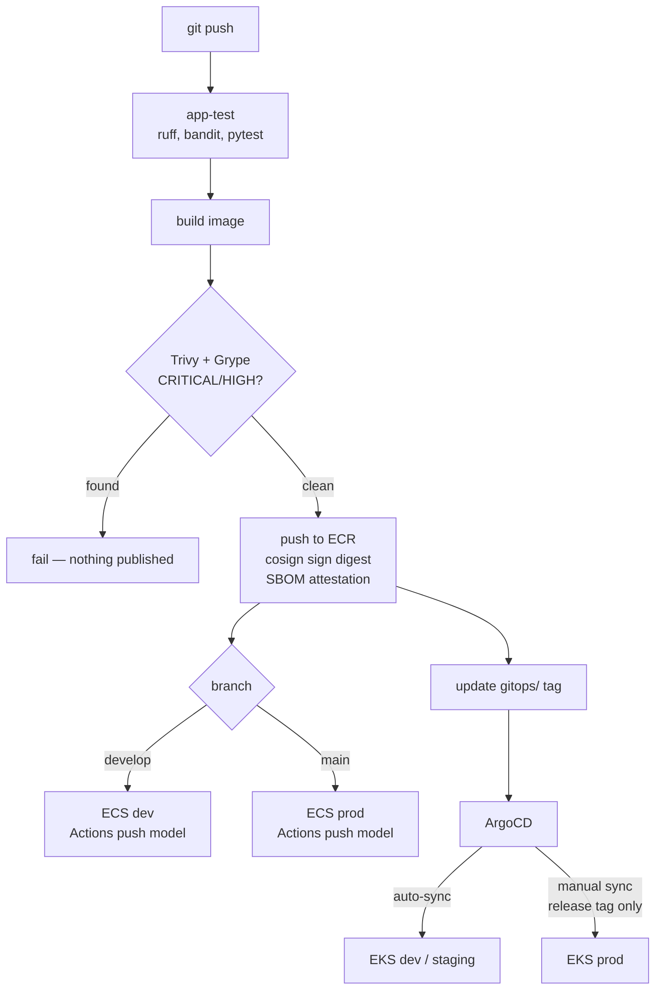
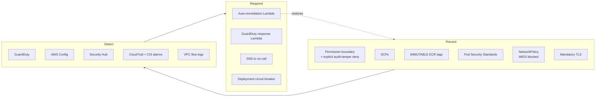

# Architecture

## Platform overview

## Network topology

Private subnets carry every workload. Public subnets carry only the NAT
gateways. Nothing is placed in a public subnet with a public IP.

Each private subnet routes through the NAT in its own AZ, so a single-AZ
failure does not take out the other zone's egress, and cross-AZ transfer
charges are avoided. `single_nat_gateway = true` collapses this to one NAT in
dev, trading that resilience for roughly $32/month.

## Delivery paths

The asymmetry is deliberate: ECS uses a push model because there is no
in-cluster reconciler for it, while Kubernetes state is reconciled from git.
See [ADR 0003](../adr/0003-gitops-with-argocd.md).

## Control coverage

