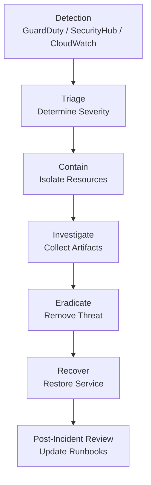

# Incident Response Runbook

## Severity Levels

| Severity | Response Time | Examples |
|---|---|---|
| P1 Critical | 15 min | Prod data breach, ransomware, root account compromise |
| P2 High | 1 hour | Elevated GuardDuty findings, public S3 exposure |
| P3 Medium | 4 hours | Config rule violations, failed MFA attempts |
| P4 Low | 24 hours | Non-critical security findings, informational |

## Incident Response Flow



## P1: EC2 Instance Compromise

### Automatic Actions (Lambda)
- Instance isolated to quarantine security group
- Forensic EBS snapshots created
- IP blocked in WAF
- Security team alerted via SNS

### Manual Steps
```bash
# 1. Confirm isolation
aws ec2 describe-instance-attribute \
  --instance-id i-XXXX \
  --attribute groupSet

# 2. Pull forensic logs
aws s3 sync s3://devsecops-aws-logs-prod/forensics/i-XXXX ./forensics/

# 3. Check CloudTrail for the instance's actions (last 24h)
aws cloudtrail lookup-events \
  --lookup-attributes AttributeKey=ResourceName,AttributeValue=i-XXXX \
  --start-time $(date -u -d '24 hours ago' +%Y-%m-%dT%H:%M:%SZ)

# 4. Capture memory via SSM (if still accessible)
aws ssm send-command \
  --instance-ids i-XXXX \
  --document-name "AWS-RunShellScript" \
  --parameters 'commands=["sudo avml /tmp/memory.lime && aws s3 cp /tmp/memory.lime s3://devsecops-aws-logs-prod/forensics/"]'

# 5. Terminate and replace instance
aws ec2 terminate-instances --instance-ids i-XXXX
```

## P1: S3 Bucket Public Exposure

```bash
# 1. Immediately block (auto-remediation should have done this)
aws s3api put-public-access-block \
  --bucket BUCKET_NAME \
  --public-access-block-configuration BlockPublicAcls=true,IgnorePublicAcls=true,BlockPublicPolicy=true,RestrictPublicBuckets=true

# 2. Check what was exposed
aws s3api get-bucket-acl --bucket BUCKET_NAME
aws s3api get-bucket-policy --bucket BUCKET_NAME

# 3. Check who accessed the bucket
aws s3api get-bucket-logging --bucket BUCKET_NAME
aws logs filter-log-events \
  --log-group-name /aws/s3/BUCKET_NAME \
  --filter-pattern "[ip, timestamp, request_id, operation=\"REST.GET.*\"]"

# 4. Check Config history for when it became public
aws configservice get-resource-config-history \
  --resource-type AWS::S3::Bucket \
  --resource-id BUCKET_NAME \
  --limit 10
```

## P2: GuardDuty High Severity Finding

```bash
DETECTOR=$(aws guardduty list-detectors --query 'DetectorIds[0]' --output text)

# Get finding details
aws guardduty get-findings \
  --detector-id $DETECTOR \
  --finding-ids FINDING_ID \
  --query 'Findings[0].{Type:Type,Severity:Severity,Description:Description,Resource:Resource}'

# Archive finding after investigation
aws guardduty update-findings-feedback \
  --detector-id $DETECTOR \
  --finding-ids FINDING_ID \
  --feedback USEFUL \
  --comments "Investigated and resolved"
```

## Post-Incident Checklist

- [ ] Timeline documented
- [ ] Root cause identified
- [ ] All affected resources audited
- [ ] Credentials rotated if compromised
- [ ] Detection gap identified
- [ ] New Config rule or GuardDuty suppression added if false positive
- [ ] Runbook updated
- [ ] Security Hub finding closed with resolution notes
