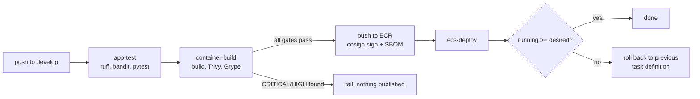

# Scenario 1: First-party API to ECS Fargate

Deploys `src/app` (the FastAPI service) to ECS Fargate behind an internal ALB,
driven entirely by `.github/workflows/devsecops-pipeline.yml`.

## What this proves

- GitHub Actions can assume an AWS role via OIDC with no long-lived keys.
- The image reaching ECR is the one that passed every scan.
- A failed deploy rolls back to the previous task definition, rather than
  force-redeploying the one that just failed.

## Flow



## Steps

### 1. Provision

```bash
cd terraform/environments/dev
terraform apply -var="certificate_arn=<acm-arn>"
```

### 2. Configure repository secrets

`AWS_ACCOUNT_ID` must be set. The workflows build the role ARN from it, and
assume `dev-cicd-deploy-role`, whose trust policy is scoped to
`repo:Mpurushotham/devsecops-aws:*`.

### 3. Trigger

```bash
git switch -c feature/change && git commit -am "..." && git push
```

On a pull request the image is built and scanned but **not** pushed: `push` is
`${{ github.event_name == 'push' }}`, so a PR gets a verdict without publishing
anything.

### 4. Verify

```bash
aws ecs describe-services --cluster dev-cluster --services dev-app-service \
  --query 'services[0].{running:runningCount,desired:desiredCount,td:taskDefinition}'
```

The ALB is internal, so reach it from inside the VPC:

```bash
aws ssm start-session --target <instance-id>
curl -sk https://<alb-dns>/health
```

## Failure modes worth knowing

**Tasks start then die.** Check the task stopped reason. If it is an image pull
error, the task security group egress or the ECR interface endpoint is wrong.
The egress rules deliberately do not allow 0.0.0.0/0, so ECR must be reachable
through the endpoint.

**Service never stabilises.** Almost always the health check. The ALB reaches
the task on the container port via `app_from_alb`; if that rule is missing the
target group never turns healthy and the circuit breaker rolls the deploy back
after ten minutes.

**Deploy succeeds but the app 503s.** The target group health check path is
`/health`, which the app answers. A 503 with healthy targets usually means the
listener is forwarding to the wrong target group.
