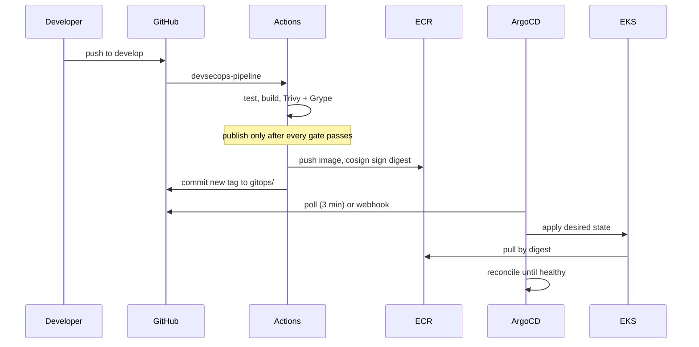

# Scenario 2: Retail store sample to EKS via GitOps

Deploys the vendored AWS retail store sample (`app/`, see `app/VENDOR.md`) onto
EKS, with ArgoCD reconciling the cluster from git.

## What this proves

- The EKS cluster's OIDC provider works, so IRSA-backed service accounts can
  assume IAM roles. Nothing else in the cluster works without it.
- Nodes in private subnets can pull images, which only holds because the VPC
  has NAT routing and interface endpoints.
- The cluster converges from git alone, with no `kubectl apply` in the path.
- Production does not move when `main` moves.

## Flow



## Steps

### 1. Provision the cluster and ArgoCD

```bash
cd terraform/environments/dev
terraform apply -var="certificate_arn=<acm-arn>"
```

This creates the cluster, the OIDC provider, the node group, and installs
ArgoCD with a single root Application pointing at `gitops/bootstrap`.

Confirm the control plane came up before going further:

```bash
aws eks update-kubeconfig --name dev-cluster --region us-east-1
kubectl get nodes
kubectl -n argocd get applications
```

`kubectl get nodes` returning nothing is the signal that node registration
failed. The usual cause is a private subnet without a NAT route, which is
exactly what the VPC module was rebuilt to fix.

### 2. Build and push the sample services

The sample is a monorepo of five services. Each has its own Dockerfile:

```bash
export ECR=<account>.dkr.ecr.us-east-1.amazonaws.com
aws ecr get-login-password | docker login --username AWS --password-stdin "$ECR"

for svc in ui catalog cart checkout orders; do
  docker build -t "$ECR/dev/$svc:v1.6.2" "app/src/$svc"
  docker push "$ECR/dev/$svc:v1.6.2"
done
```

The `dev/ui`, `dev/catalog`, `dev/cart`, `dev/checkout` and `dev/orders`
repositories are created by the `ecr` module in each environment.

Note that these repositories are `IMMUTABLE`: pushing `v1.6.2` twice fails by
design, so a tag always refers to the bytes that were scanned.

### 3. Let ArgoCD converge

```bash
kubectl -n argocd get applications -w
```

`app-dev` and `app-staging` sync automatically. `app-prod` does not: it tracks
the tag `v1.0.0` and has no automated sync policy, so it will sit in
`OutOfSync` until someone triggers it deliberately. That is the intended
behaviour, not a fault.

### 4. Verify

```bash
kubectl -n dev get pods
kubectl -n dev run smoke --rm -it --restart=Never \
  --image=curlimages/curl:8.11.1 -- \
  curl -sSf http://app-app.dev.svc.cluster.local/health
```

### 5. Prove reconciliation

Delete something and watch it come back:

```bash
kubectl -n dev delete deployment app-app
kubectl -n dev get deployment -w      # recreated within the reconcile window
```

If it does not return, `selfHeal` is not doing its job and the GitOps claim is
not true for this cluster.

## Promotion to production

```bash
git tag v1.1.0 && git push origin v1.1.0
# update targetRevision in gitops/applications/app-prod.yaml, open a PR
```

Production changes are therefore visible as a reviewable diff, and the cluster
state is whatever the last merged commit says it is.

## Teardown

```bash
kubectl -n argocd delete application root   # cascades via the finalizer
cd terraform/environments/dev && terraform destroy
```

Delete the root Application first. Destroying the cluster underneath ArgoCD
leaves the finalizers unresolvable, and the namespace then hangs in
`Terminating`.
