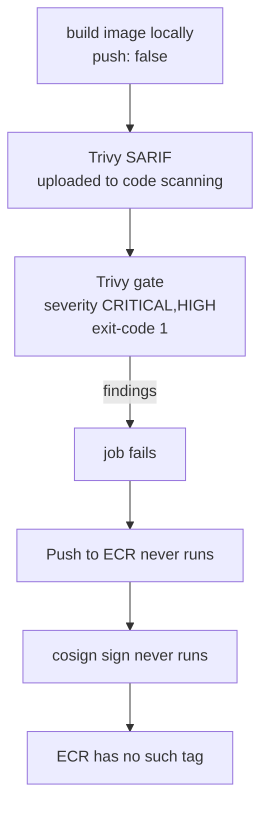

# Scenario 3: A vulnerable image is blocked

Demonstrates that the pipeline refuses to publish, rather than reporting a
finding and continuing. This is the scenario that distinguishes a security
pipeline from a security dashboard.

## What this proves

- The scan gate is a gate, not a notification.
- The signature covers the digest that was actually published.

## Reproduce

Introduce a known-vulnerable dependency:

```bash
cd src/app
echo "requests==2.19.1" >> requirements.txt   # CVE-2018-18074 and others
git commit -am "test: deliberately vulnerable dependency" && git push
```

## Expected outcome



Three things should be true afterwards:

1. The workflow run is red at **Fail build on CRITICAL or HIGH CVEs**.
2. The findings are visible under Security → Code scanning, because the SARIF
   upload runs with `if: always()` and precedes the gate.
3. `aws ecr describe-images --repository-name dev/api` does not list the tag.

Point 3 is the one that matters. The image is built before it is scanned, but
it is only ever pushed after the gate, which is why the ordering in
`container-build.yml` was changed: the previous version signed a digest from a
`push: false` build, which is empty, so the signature was meaningless.

## Also blocked at other layers

| Layer | Control | Effect |
|---|---|---|
| Dependency | `pip-audit --strict` | fails before an image is built |
| IaC | Trivy config, Checkov | fails before anything is provisioned |
| Registry | ECR `scan_on_push` | flags anything that got through |
| Registry | `IMMUTABLE` tags | a scanned tag cannot be quietly replaced |
| Runtime | ECR repository policy | denies pull of CRITICAL-flagged images |

## Clean up

```bash
git revert HEAD && git push
```
